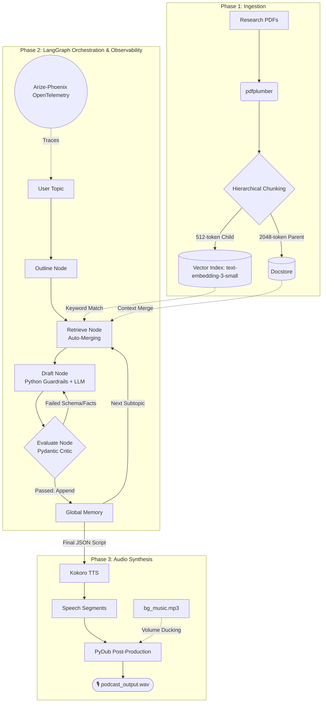

# Agentic Podcast Studio

An autonomous, production-grade AI podcast generator featuring OpenTelemetry observability, deterministic state guardrails, and hierarchical RAG.

This project takes a folder of PDF research papers and transforms them into a studio-quality, multi-speaker podcast. It leverages a LangGraph Agentic Swarm powered by frontier models (`gpt-4o-mini` via OpenRouter) to draft and self-correct the script, LlamaIndex Hierarchical Retrieval for deep contextual accuracy, and Kokoro TTS + PyDub for dynamic voice assignment and cinematic audio post-production.

---

## Key Features

- Powered by OpenRouter and standard OpenAI APIs, utilizing models like `gpt-4o-mini` for flawless JSON schema adherence and highly intelligent persona adoption (e.g., the Skeptical Data Journalist).

- **Hierarchical Parent-Child Retrieval**: Uses LlamaIndex's `AutoMergingRetriever` and `text-embedding-3-small`. It searches granular 512-token child sentences for keyword precision, but automatically merges them into 2048-token parent paragraphs before feeding the LLM, drastically reducing hallucinations and metadata loss.

- **Full-Stack Observability (LLMOps)**: Integrated with **Arize-Phoenix**. Every token, retrieval span, chunk merge, and agentic loop is tracked via OpenTelemetry and visualized in a gorgeous local dashboard.

- **Deterministic Python Guardrails & Agentic Self-Correction**: Eliminates the "Monologue Trap" and LLM speaker drift. Python string manipulation deterministically enforces strict `Host -> Guest` turn-taking, while a Pydantic-powered LLM Critic fact-checks metrics and enforces conversational constraints.

- The Map-Reduce pipeline passes conversational state between loops. The Drafter reads the previous subtopic's output, ensuring smooth, natural transitions across different concepts without repeating facts.

- **Dynamic Audio Post-Production**:

  - **Auto-Casting**: Automatically detects emergent speaker names in the script and assigns them unique Kokoro voices on the fly.

  - **Natural Pacing**: Programmatically injects 600ms pauses between speakers for human-like breathing room.

  - **Audio Ducking**: Automatically loops a background music track (`bg_music.mp3`), ducking the volume down during speech and fading it up during transitions.

- **Streamlit Web Dashboard**: A sleek UI to upload PDFs, watch the LangGraph swarm execute in real-time, read the color-coded cited script, and listen to the final episode.

---

## System Architecture



1. **Ingestion Phase (`src/ingestion.py`)**: pdfplumber extracts text and page numbers. `HierarchicalNodeParser` chunks the text into a family tree of 2048-token Parent paragraphs and 512-token Child sentences, stored locally.

2. **Orchestration Phase (`src/workflow.py`)**:

   - User inputs a topic.

  - The LLM writes an outline of 3 subtopics.

  - Loop: For each subtopic -> Retrieve Context -> Draft Script -> Critic Evaluates -> (Retry if failed) -> Save to Global Memory.

3. **Synthesis Phase (`src/audio.py`)**: The finalized JSON script is parsed. Kokoro TTS generates WAV files per line. Pydub stitches them together, applies pacing, and mixes the background music.

---

## Project Structure

```
.
├── app.py                  # Streamlit frontend dashboard
├── main.py                 # CLI execution script (Alternative to Streamlit)
├── src/
│   ├── llm.py              # OpenRouter LLM wrapper for LangGraph
│   ├── workflow.py         # LangGraph nodes, state, and Auto-Merging Retrieval
│   ├── ingestion.py        # PDF parsing and Hierarchical Vector DB creation
│   ├── bg_music.mp3        # (User added) Background audio track
│   └── audio.py            # Kokoro TTS generation & Pydub post-production
├── data/                   # Directory where uploaded PDFs are stored
└── storage/                # Auto-generated LlamaIndex database

```

---

## Installation & Setup

This project requires a mix of system-level audio dependencies (for TTS phonetics and audio mixing) and Python packages.

### 1. System Dependencies (OS Level)

You must install FFmpeg (for PyDub audio manipulation) and eSpeak-NG (the phonetic engine required by Kokoro TTS to sound out words).

- **macOS**:

```bash
brew install ffmpeg espeak-ng
```
- **Linux (Ubuntu/Debian)**:

```bash
sudo apt update
sudo apt install ffmpeg espeak-ng
```

- **Windows**

  - Install FFmpeg via Winget: `winget install ffmpeg`

  - Install eSpeak-NG via Winget: `winget install eSpeak-NG.eSpeak-NG` (Or download the installer from the eSpeak-NG GitHub releases).

### 2. Python Environment Setup

It is highly recommended to use a virtual environment (Python 3.10+) to avoid package conflicts.

```bash
# Create and activate a virtual environment
python -m venv podcast_env

# On Mac/Linux:
source podcast_env/bin/activate
# On Windows:
podcast_env\Scripts\activate
```
### 3. Install Python Packages

With your virtual environment activated, install the required libraries:

```bash
pip install -r requirements.txt
```
*(A note on Kokoro TTS: By using `from kokoro import KPipeline`, the package will automatically download the required Kokoro model weights and voice pack `.pt` files directly from HuggingFace on your very first run. This means your first podcast generation will take a little longer as it caches the voices, but will be completely offline for all subsequent runs)*.

---

## How to Use

### 1. Configure Environment Variables

The project uses OpenRouter to access frontier models (like `gpt-4o-mini` or `llama-3.1-70b-instruct`) and the OpenAI API for embeddings (`text-embedding-3-small`). Set your API key in your terminal before launching:

```bash
OPENROUTER_API_KEY="sk-or-v1-your-actual-api-key-here"
```

### 2. Optional: Add Background Music

For the full studio experience, download any royalty-free lo-fi or ambient MP3 track, name it `bg_music.mp3`, and place it directly in the sub-directory (`src/`). The audio engine will automatically find it and apply dynamic volume ducking.

### 3. Launch the Studio

Start the Streamlit dashboard:

```bash
streamlit run app.py
```


### 4. Generate a Podcast

1. Open the web interface (usually `http://localhost:8501`).

2. Use the sidebar to upload your research PDFs.

3. Click "💾 Save & Build Database". (This builds the Hierarchical Vector DB).


4. Enter your desired topic in the main text box (e.g., *"How do large language models perform during iterative self-correction?"*).

5. Click "🚀 Generate Podcast".


6. Open your Phoenix dashboard (`http://localhost:6006`) to watch the retrieval spans and LangGraph nodes execute in real-time.

7. Once finished, read the cleanly cited script in the Streamlit UI and hit play on the generated audio widget.